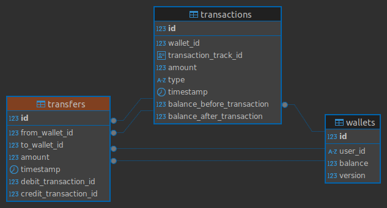

# Wallet Service - Backend

## Technologies

- Java 21
- Maven 21
- Docker
- Docker Compose
- PostgreSQL
- Spring Boot
- Swagger

## Requirements

### Docker and Docker Compose

To run this system you will need to have docker and docker-compose

- Docker install

```
sudo apt-get update && sudo apt-get install \
    apt-transport-https \
    ca-certificates \
    curl \
    gnupg-agent \
    software-properties-common && curl -fsSL https://download.docker.com/linux/ubuntu/gpg | sudo apt-key add - && sudo apt-key fingerprint 0EBFCD88 && sudo add-apt-repository \
   "deb [arch=amd64] https://download.docker.com/linux/ubuntu \
   $(lsb_release -cs) \
   stable" && sudo apt-get update &&  sudo apt-get install docker-ce docker-ce-cli containerd.io -y && sudo
 
    usermod -aG docker $USER && sudo chown $USER /var/run/docker.sock
```

- Docker Compose install

```
    sudo curl -L "https://github.com/docker/compose/releases/download/1.26.2/docker-compose-$(uname -s)-$(uname -m)" -o /usr/local/bin/docker-compose &&
    sudo chmod +x /usr/local/bin/docker-compose &&
    sudo ln -s /usr/local/bin/docker-compose /usr/bin/docker-compose
```

## Starting services

### 1. Build project

```
$ mvn clean install
```

### 2. Initializing the microservice

- Init docker compose located at `src/main/resources/compose/docker-compose.yml` with the command `docker-compose up`
- Then you just need to init WalletApplication on any IDEA or run the command `mvn spring-boot:run` from project root directory

## API Documentation

- Swagger url is available at http://localhost:8080/wallet/swagger-ui/index.html after the service is up
- There is also a Postman collection located at ```collections/Wallet.postman_collection.json```

## Design Choices

This project was written in Java with Spring Boot, PostgreSQL for database and Kafka to process asynchronous transactions.
I delivered six endpoints to make some wallet operations: create wallet, retrieve wallet balance, deposit money, withdraw money, transfer money from an account to another and get transaction information by a specific date in the past.

Basically, I initially created all the database design and divided into three entities: Wallet, Transaction and Transfer.
With the Wallet entity I can create my wallet and retrieve wallet balance.

The Transaction entity was needed for deposit, withdraw and transfer money and transaction history, so when I need to get a transaction history I can filter by date and the wallet user id; and I save beforeBalance and afterBalance for any transaction.

Transfer entity exists to save relation with deposit money transaction and withdraw money transaction, so I can keep the transfer history in case I need to track it in the future.

Following is the system database diagram:



To treat concurrency I added a field called version into Wallet entity and in any consult into database I use pessimist lock to avoid concurrent instances.

Furthermore, when I create deposit, withdraw and transfer money it returns to the user a transaction id and the process occurs asynchronous. This way

I can guarantee that transactions will be performed in order. I also can scale my system based on the demand. My system with Kafka is also resilient and failure tolerant.

If an error occurs during a transaction the message will be keeped in the topic and will be processed later (I am commiting messages only after all process - manually).

My Kafka is FIFO type, first in first out, so in a bank system I can guarantee that operations will be performed without one transaction affecting another one. And when I produce a message to Kafka topic I configured transactions to ensure that only one message will be posted.


Still talking about Kafka, I'm handling failure messages using Kafka Retryable, configuring how many times I want to retry an operation and if it still keep failing, I can send a message to a dead letter queue (dlt).

As Design of the application, and with the short time to develop, I chose to create services that are called from controller, in a simple way. But to keep the code more readable I used a Factory and Strategy Design Patterns to organize my code.


I also treated exceptions during the process and log all of them.
And during system operations I still logged relevant information as transaction id and user id, this way with an error in production for example I can troubleshoot easily.

Unit tests and functional tests with test container were made to maintain code safer.

Due to limited time I couldn't configure security mechanism like Spring Security. Maybe in another version it was cool to implement an access token control on endpoint call.
